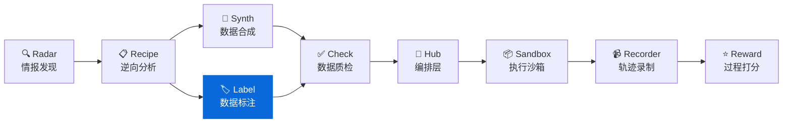
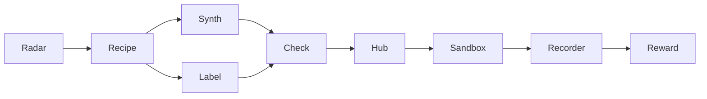

<div align="center">

# DataLabel

**轻量级数据标注工具 - 零服务器依赖的 HTML 标注界面**  
**Lightweight, serverless HTML labeling tool for offline teams**

[](https://pypi.org/project/knowlyr-datalabel/)
[](https://www.python.org/downloads/)
[](LICENSE)
[](#mcp-server)

[快速开始](#快速开始) · [结果合并](#结果合并) · [MCP Server](#mcp-server) · [Data Pipeline 生态](#data-pipeline-生态)

</div>

---

**GitHub Topics**: `data-labeling`, `offline-first`, `html`, `iaa`, `llm`

生成独立的 HTML 标注界面，无需部署服务器，浏览器直接打开即可使用。支持多标注员结果合并与一致性分析。

## 核心能力 / Core Capabilities

```
数据 Schema + 任务列表 → 生成 HTML → 浏览器标注 → 导出结果 → 合并分析
```

### 界面预览 / UI Preview

```
├─ 指令
│  └─ 「根据提示写一个创意故事」
├─ 回复
│  └─ 「很久以前...
├─ 评分滑块 (1-5)   ├─ 复选标签
└─ 备注文本框        └─ 快捷键提示 (J/K)

示意图: `docs/images/annotator_ui.png`
```

### 特性一览 / Highlights

| 特性 | 说明 |
|------|------|
| 🚀 **零依赖部署** | 生成的 HTML 包含所有样式和逻辑，无需服务器 |
| 💾 **离线可用** | 标注数据保存在 localStorage，支持断点续标 |
| 👥 **多标注员** | 合并多个标注结果，计算一致性指标 (IAA) |
| 🔗 **DataRecipe 集成** | 直接从 DataRecipe 分析结果生成标注界面 |
| 🤖 **MCP 支持** | 可作为 Claude 的工具使用 |

### 工作流 / Workflow

| 步骤 | 命令 | 产出 |
|------|------|------|
| 1️⃣ 生成界面 | `knowlyr-datalabel generate` | `annotator.html` |
| 2️⃣ 分发标注 | 发送 HTML 给标注员 | 浏览器中完成标注 |
| 3️⃣ 收集结果 | 标注员导出 JSON | `annotator_*.json` |
| 4️⃣ 合并分析 | `knowlyr-datalabel merge` | `merged.json` + 一致性报告 |

> 推荐实践：
> - 将 `annotator.html` 与 `README.md` 一起存放，方便标注员查阅指南。
> - 要求标注员使用 `导出 -> {姓名}_{版本}.json`，方便溯源。
> - 建议将导出的 JSON 存入版本库或对象存储，并通过 PR 进行审核。

## 安装 / Installation

```bash
pip install knowlyr-datalabel
```

可选依赖：

```bash
pip install knowlyr-datalabel[mcp]      # MCP 服务器
pip install knowlyr-datalabel[dev]      # 开发依赖
pip install knowlyr-datalabel[all]      # 全部功能
```

## 快速开始 / Quick Start

### 从 DataRecipe 分析结果生成 / From DataRecipe Outputs

```bash
# 从 DataRecipe 分析输出目录生成标注界面
knowlyr-datalabel generate ./analysis_output/my_dataset/
```

<details>
<summary>输出示例</summary>

```
正在从 ./analysis_output/my_dataset/ 生成标注界面...
✓ 生成成功: ./analysis_output/my_dataset/10_标注工具/annotator.html
  任务数量: 50

在浏览器中打开此文件即可开始标注
```

</details>

生成的 `reports/merge_report.md` 包含：
- 每个任务的多标注源详情与冲突原因
- 需要人工复核的条目列表
- IAA 指标（整体一致率 + pairwise 矩阵）

### 从自定义 Schema 创建 / From Custom Schema

```bash
# 从 Schema 和任务文件创建标注界面
knowlyr-datalabel create schema.json tasks.json -o annotator.html

# 附带标注指南
knowlyr-datalabel create schema.json tasks.json -o annotator.html -g guidelines.md
```

<details>
<summary>Schema 格式示例</summary>

```json
{
  "project_name": "我的标注项目",
  "fields": [
    {"name": "instruction", "display_name": "指令", "type": "text"},
    {"name": "response", "display_name": "回复", "type": "text"}
  ],
  "scoring_rubric": [
    {"score": 1, "label": "差", "description": "回复质量差"},
    {"score": 2, "label": "中", "description": "回复质量一般"},
    {"score": 3, "label": "好", "description": "回复质量好"}
  ]
}
```

</details>

> IAA 解释：完全一致率 <40% 时通常表示标注指南存在歧义，建议回顾培训或同步口径。

---

## 结果合并 / Result Aggregation

### 合并多个标注员结果 / Merge Annotators

```bash
# 合并三个标注员的结果
knowlyr-datalabel merge ann1.json ann2.json ann3.json -o merged.json

# 使用不同的合并策略
knowlyr-datalabel merge *.json -o merged.json --strategy average
```

<details>
<summary>输出示例</summary>

```
正在合并 3 个标注结果...
  策略: majority
✓ 合并成功: merged.json
  任务总数: 100
  标注员数: 3
  一致率: 78.0%
  冲突数: 22
```

</details>

### 合并策略 / Strategies

| 策略 | 说明 | 适用场景 |
|------|------|----------|
| `majority` | 多数投票，选择最多人选择的分数 | 通用场景 (默认) |
| `average` | 取所有分数的平均值 | 连续评分 |
| `strict` | 仅当所有人一致时才确定，否则标记需审核 | 高质量要求 |

### 计算标注一致性 (IAA) / IAA Metrics

```bash
knowlyr-datalabel iaa ann1.json ann2.json ann3.json
```

<details>
<summary>输出示例</summary>

```
正在计算 3 个标注结果的 IAA...

标注员间一致性 (IAA) 指标:
  标注员数: 3
  共同任务: 100
  完全一致率: 45.0%

两两一致矩阵:
              ann1.json  ann2.json  ann3.json
ann1.json       100.0%      72.0%      68.0%
ann2.json        72.0%     100.0%      75.0%
ann3.json        68.0%      75.0%     100.0%
```

</details>

---

## 数据格式 / Data Formats

### 任务格式 / Task Schema

```json
{
  "samples": [
    {
      "id": "TASK_001",
      "data": {
        "instruction": "请解释什么是机器学习",
        "response": "机器学习是..."
      }
    }
  ]
}
```

### 标注结果格式 / Result Schema

```json
{
  "metadata": {
    "annotator": "annotator_name",
    "completed_at": "2024-01-01T12:00:00"
  },
  "responses": [
    {
      "task_id": "TASK_001",
      "score": 3,
      "comment": "回复准确且详细"
    }
  ]
}
```

---

## MCP Server / Claude Integration

在 Claude Desktop / Claude Code 中直接使用。

### 配置

添加到 `~/Library/Application Support/Claude/claude_desktop_config.json`：

```json
{
  "mcpServers": {
    "knowlyr-datalabel": {
      "command": "uv",
      "args": ["--directory", "/path/to/data-label", "run", "python", "-m", "datalabel.mcp_server"]
    }
  }
}
```

### 可用工具

| 工具 | 功能 |
|------|------|
| `generate_annotator` | 从 DataRecipe 分析结果生成标注界面 |
| `create_annotator` | 从 Schema 和任务创建标注界面 |
| `merge_annotations` | 合并多个标注结果 |
| `calculate_iaa` | 计算标注员间一致性 |

### 使用示例

```
用户: 帮我从 ./output/my_dataset 生成标注界面

Claude: [调用 generate_annotator]
        ✅ 标注界面已生成:
        - 输出路径: ./output/my_dataset/10_标注工具/annotator.html
        - 任务数量: 50

        在浏览器中打开此文件即可开始标注。
```

---

## Data Pipeline 生态

DataLabel 是 Data Pipeline 生态的标注组件：



### 生态项目

| 层 | 项目 | 说明 | 仓库 |
|---|---|---|---|
| 情报 | **AI Dataset Radar** | 数据集竞争情报、趋势分析 | [GitHub](https://github.com/liuxiaotong/ai-dataset-radar) |
| 分析 | **DataRecipe** | 逆向分析、Schema 提取、成本估算 | [GitHub](https://github.com/liuxiaotong/data-recipe) |
| 生产 | **DataSynth** | LLM 批量合成、种子数据扩充 | [GitHub](https://github.com/liuxiaotong/data-synth) |
| 生产 | **DataLabel** | 轻量标注工具、多标注员合并 | You are here |
| 质检 | **DataCheck** | 规则验证、重复检测、分布分析 | [GitHub](https://github.com/liuxiaotong/data-check) |
| Agent | **AgentSandbox** | Docker 执行沙箱、轨迹重放 | [GitHub](https://github.com/liuxiaotong/agent-sandbox) |
| Agent | **AgentRecorder** | 标准化轨迹录制、多框架适配 | [GitHub](https://github.com/liuxiaotong/agent-recorder) |
| Agent | **AgentReward** | 过程级 Reward、Rubric 多维评估 | [GitHub](https://github.com/liuxiaotong/agent-reward) |
| 编排 | **TrajectoryHub** | Pipeline 编排、数据集导出 | [GitHub](https://github.com/liuxiaotong/agent-trajectory-hub) |

### 端到端工作流

```bash
# 1. DataRecipe: 分析数据集，生成 Schema 和样例
knowlyr-datarecipe deep-analyze tencent/CL-bench -o ./output

# 2. DataLabel: 生成标注界面，人工标注/校准种子数据
knowlyr-datalabel generate ./output/tencent_CL-bench/

# 3. DataSynth: 基于种子数据批量合成
knowlyr-datasynth generate ./output/tencent_CL-bench/ -n 1000

# 4. DataCheck: 质量检查
knowlyr-datacheck validate ./output/tencent_CL-bench/
```

### 四合一 MCP 配置

```json
{
  "mcpServers": {
    "knowlyr-datarecipe": {
      "command": "uv",
      "args": ["--directory", "/path/to/data-recipe", "run", "knowlyr-datarecipe-mcp"]
    },
    "knowlyr-datalabel": {
      "command": "uv",
      "args": ["--directory", "/path/to/data-label", "run", "python", "-m", "datalabel.mcp_server"]
    },
    "knowlyr-datasynth": {
      "command": "uv",
      "args": ["--directory", "/path/to/data-synth", "run", "python", "-m", "datasynth.mcp_server"]
    },
    "knowlyr-datacheck": {
      "command": "uv",
      "args": ["--directory", "/path/to/data-check", "run", "python", "-m", "datacheck.mcp_server"]
    }
  }
}
```

---

## 命令参考

| 命令 | 功能 |
|------|------|
| `knowlyr-datalabel generate <dir>` | 从 DataRecipe 分析结果生成标注界面 |
| `knowlyr-datalabel create <schema> <tasks> -o <out>` | 从自定义 Schema 创建标注界面 |
| `knowlyr-datalabel merge <files...> -o <out>` | 合并多个标注结果 |
| `knowlyr-datalabel merge <files...> -s <strategy>` | 指定合并策略 |
| `knowlyr-datalabel iaa <files...>` | 计算标注员间一致性 |

---

## API 使用

### 生成标注界面

```python
from datalabel import AnnotatorGenerator

generator = AnnotatorGenerator()
result = generator.generate(
    schema={"fields": [...], "scoring_rubric": [...]},
    tasks=[{"id": "1", "data": {...}}],
    output_path="annotator.html",
    guidelines="# 标注指南\n\n请按照以下标准...",
    title="我的标注项目",
)
```

### 合并标注结果

```python
from datalabel import ResultMerger

merger = ResultMerger()
result = merger.merge(
    result_files=["ann1.json", "ann2.json", "ann3.json"],
    output_path="merged.json",
    strategy="majority",
)

print(f"一致率: {result.agreement_rate:.1%}")
print(f"冲突数: {len(result.conflicts)}")
```

---

## 项目架构

```
src/datalabel/
├── generator.py          # HTML 标注界面生成器
├── merger.py             # 标注结果合并 & IAA 计算
├── cli.py                # CLI 命令行工具
├── mcp_server.py         # MCP Server (4 工具)
└── templates/
    └── annotator.html    # Jinja2 HTML 模板
```

---

## License

[MIT](LICENSE)

---

## AI Data Pipeline 生态

> 9 个工具覆盖 AI 数据工程全流程，均支持 CLI + MCP，可独立使用也可组合成流水线。

| Tool | Description | Link |
|------|-------------|------|
| **AI Dataset Radar** | Competitive intelligence for AI training datasets | [GitHub](https://github.com/liuxiaotong/ai-dataset-radar) |
| **DataRecipe** | Reverse-engineer datasets into annotation specs & cost models | [GitHub](https://github.com/liuxiaotong/data-recipe) |
| **DataSynth** | Seed-to-scale synthetic data generation | [GitHub](https://github.com/liuxiaotong/data-synth) |
| **DataLabel** | Lightweight, serverless HTML labeling tool | You are here |
| **DataCheck** | Automated quality checks & anomaly detection | [GitHub](https://github.com/liuxiaotong/data-check) |
| **AgentSandbox** | Reproducible Docker sandbox for Code Agent execution | [GitHub](https://github.com/liuxiaotong/agent-sandbox) |
| **AgentRecorder** | Standardized trajectory recording for Code Agents | [GitHub](https://github.com/liuxiaotong/agent-recorder) |
| **AgentReward** | Process-level rubric-based reward engine | [GitHub](https://github.com/liuxiaotong/agent-reward) |
| **TrajectoryHub** | Pipeline orchestrator for Agent trajectory data | [GitHub](https://github.com/liuxiaotong/agent-trajectory-hub) |



---

<div align="center">
<sub>为数据标注团队提供轻量级、零部署的标注解决方案</sub>
</div>
