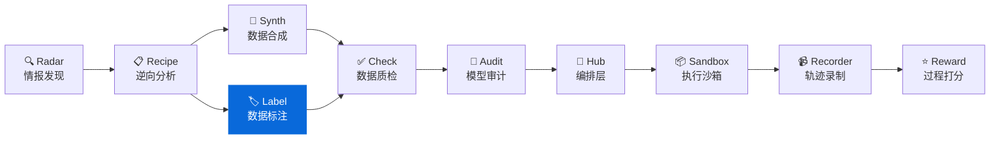

<div align="center">

# DataLabel

**轻量级数据标注工具 — 零服务器依赖的 HTML 标注界面**
**Lightweight, serverless HTML labeling tool for offline annotation teams**

[](https://pypi.org/project/knowlyr-datalabel/)
[](https://www.python.org/downloads/)
[](LICENSE)
[](#mcp-server)
[](#llm-分析)
[](#docker)

[快速开始](#快速开始) · [标注类型](#标注类型) · [LLM 分析](#llm-分析) · [结果合并](#结果合并) · [IAA 指标](#计算标注一致性-iaa) · [MCP Server](#mcp-server) · [Docker](#docker) · [生态](#data-pipeline-生态)

</div>

---

**GitHub Topics**: `data-labeling`, `annotation`, `offline-first`, `mcp`, `ai-data-pipeline`

生成独立的 HTML 标注界面，无需部署服务器，浏览器直接打开即可使用。支持 5 种标注类型、暗黑模式、撤销、统计面板、多格式导入导出，以及多标注员结果合并与一致性分析。内置 LLM 分析能力（Kimi/Moonshot、OpenAI、Anthropic），支持自动预标注、标注质量审核、标注指南生成。

## 核心能力

```
数据 Schema + 任务列表 → [LLM 预标注] → 生成 HTML → 浏览器标注 → 导出结果 → [LLM 质量分析] → 合并分析
```

### 特性一览

| 特性 | 说明 |
|------|------|
| **零依赖部署** | 生成的 HTML 包含所有样式和逻辑，无需服务器 |
| **离线可用** | 标注数据保存在 localStorage，支持断点续标 |
| **5 种标注类型** | 评分、单选、多选、文本、排序 |
| **暗黑模式** | 一键切换，跟随系统偏好，localStorage 持久化 |
| **撤销支持** | `Ctrl+Z` 撤销当前任务标注 |
| **统计面板** | 实时完成率、分数/选项分布图 |
| **快捷键** | `←` `→` 导航、数字键评分/选择、`?` 快捷键帮助 |
| **大数据集** | 任务侧边栏 + 分页 + 搜索/过滤，支持 1000+ 任务 |
| **多标注员** | 合并多个标注结果，计算 IAA (Cohen's/Fleiss' Kappa, Krippendorff's Alpha) |
| **多格式导入导出** | JSON / JSONL / CSV 三种格式 |
| **Schema 校验** | 输入验证 + 友好的中文错误提示 |
| **DataRecipe 集成** | 直接从 DataRecipe 分析结果生成标注界面 |
| **LLM 自动预标注** | 使用 Kimi/OpenAI/Anthropic 自动预标注，加速标注流程 |
| **LLM 质量分析** | 检测可疑标注、分析多标注员分歧 |
| **LLM 指南生成** | 根据 Schema 和样例自动生成标注指南 |
| **MCP 支持** | 10 工具 + 6 资源 + 3 Prompt 模板，可作为 Claude Desktop / Claude Code 的工具使用 |
| **Docker** | 容器化运行，无需安装 Python 环境 |

### 工作流

| 步骤 | 命令 | 产出 |
|------|------|------|
| 1. 生成指南 | `knowlyr-datalabel gen-guidelines schema.json -o guide.md` | `guide.md` (可选) |
| 2. 预标注 | `knowlyr-datalabel prelabel schema.json tasks.json -o pre.json` | `pre.json` (可选) |
| 3. 生成界面 | `knowlyr-datalabel create schema.json tasks.json -o annotator.html` | `annotator.html` |
| 4. 分发标注 | 发送 HTML 给标注员 | 浏览器中完成标注 |
| 5. 收集结果 | 标注员导出 JSON/JSONL/CSV | `results_*.json` |
| 6. 质量分析 | `knowlyr-datalabel quality schema.json results_*.json -o report.json` | `report.json` (可选) |
| 7. 合并分析 | `knowlyr-datalabel merge results_*.json -o merged.json` | `merged.json` + IAA 报告 |

## 安装

```bash
pip install knowlyr-datalabel
```

可选依赖：

```bash
pip install knowlyr-datalabel[mcp]      # MCP 服务器
pip install knowlyr-datalabel[llm]      # LLM 分析 (Kimi/OpenAI)
pip install knowlyr-datalabel[llm-all]  # LLM 分析 (含 Anthropic)
pip install knowlyr-datalabel[dev]      # 开发依赖 (pytest, ruff)
pip install knowlyr-datalabel[all]      # 全部功能
```

## 快速开始

### 从自定义 Schema 创建

```bash
knowlyr-datalabel create schema.json tasks.json -o annotator.html

# 附带标注指南和自定义标题
knowlyr-datalabel create schema.json tasks.json -o annotator.html -g guidelines.md -t "我的项目"

# 自定义分页大小 (默认 50)
knowlyr-datalabel create schema.json tasks.json -o annotator.html --page-size 100
```

### 从 DataRecipe 分析结果生成

```bash
knowlyr-datalabel generate ./analysis_output/my_dataset/
```

### Schema 格式示例

```json
{
  "project_name": "我的标注项目",
  "fields": [
    {"name": "instruction", "display_name": "指令", "type": "text"},
    {"name": "response", "display_name": "回复", "type": "text"}
  ],
  "scoring_rubric": [
    {"score": 1, "label": "优秀", "description": "回答完整准确"},
    {"score": 0.5, "label": "一般", "description": "回答基本正确"},
    {"score": 0, "label": "差", "description": "回答错误或离题"}
  ]
}
```

### 验证 Schema 格式

```bash
# 仅验证 Schema
knowlyr-datalabel validate schema.json

# 同时验证 Schema 和任务数据
knowlyr-datalabel validate schema.json -t tasks.json
```

---

## 标注类型

DataLabel 支持 5 种标注类型，通过 Schema 中的 `annotation_config` 配置。不配置时默认使用 `scoring_rubric` 评分模式。

### 1. 评分 (scoring) — 默认

使用 `scoring_rubric` 定义评分标准，无需 `annotation_config`。

```json
{
  "scoring_rubric": [
    {"score": 1, "description": "优秀"},
    {"score": 0.5, "description": "一般"},
    {"score": 0, "description": "差"}
  ]
}
```

### 2. 单选 (single_choice)

```json
{
  "annotation_config": {
    "type": "single_choice",
    "options": [
      {"value": "positive", "label": "正面"},
      {"value": "negative", "label": "负面"},
      {"value": "neutral", "label": "中性"}
    ]
  }
}
```

### 3. 多选 (multi_choice)

```json
{
  "annotation_config": {
    "type": "multi_choice",
    "options": [
      {"value": "informative", "label": "信息丰富"},
      {"value": "accurate", "label": "准确"},
      {"value": "fluent", "label": "流畅"}
    ]
  }
}
```

### 4. 文本 (text)

```json
{
  "annotation_config": {
    "type": "text",
    "placeholder": "请输入翻译...",
    "max_length": 500
  }
}
```

### 5. 排序 (ranking)

支持拖拽排序。

```json
{
  "annotation_config": {
    "type": "ranking",
    "options": [
      {"value": "a", "label": "结果A"},
      {"value": "b", "label": "结果B"},
      {"value": "c", "label": "结果C"}
    ]
  }
}
```

---

## LLM 分析

DataLabel 内置 LLM 分析能力，支持三个提供商：

| 提供商 | 环境变量 | 默认模型 | SDK |
|--------|----------|----------|-----|
| **Moonshot (Kimi)** | `MOONSHOT_API_KEY` | moonshot-v1-8k | openai (兼容) |
| **OpenAI** | `OPENAI_API_KEY` | gpt-4o-mini | openai |
| **Anthropic** | `ANTHROPIC_API_KEY` | claude-sonnet-4-20250514 | anthropic |

### 1. 自动预标注

使用 LLM 对任务数据进行批量预标注，加速标注流程：

```bash
# 使用 Kimi 预标注（默认）
export MOONSHOT_API_KEY=sk-...
knowlyr-datalabel prelabel schema.json tasks.json -o prelabeled.json

# 使用 OpenAI
knowlyr-datalabel prelabel schema.json tasks.json -o prelabeled.json -p openai

# 指定模型和批大小
knowlyr-datalabel prelabel schema.json tasks.json -o prelabeled.json -p moonshot -m kimi-k2 --batch-size 10
```

预标注结果格式与人工标注完全一致，可直接用于标注界面的预填充。

### 2. 标注质量分析

使用 LLM 检测可疑标注，分析多标注员分歧：

```bash
# 单标注员质量检查
knowlyr-datalabel quality schema.json results.json -o report.json -p moonshot

# 多标注员分歧分析
knowlyr-datalabel quality schema.json ann1.json ann2.json -o report.json
```

分析内容包括：
- 与内容明显不匹配的标注
- 标注模式异常（如全部相同分数）
- 多标注员分歧原因和解决建议

### 3. 标注指南生成

根据 Schema 和样例数据自动生成标注指南文档：

```bash
# 生成中文指南
knowlyr-datalabel gen-guidelines schema.json -t tasks.json -o guidelines.md

# 生成英文指南
knowlyr-datalabel gen-guidelines schema.json -t tasks.json -o guidelines.md -l en

# 使用 OpenAI
knowlyr-datalabel gen-guidelines schema.json -o guidelines.md -p openai
```

生成的指南包含：项目概述、字段说明、标注操作说明、评判标准、标注示例、边界情况、注意事项。

---

## 结果合并

### 合并多个标注员结果

```bash
# 合并三个标注员的结果
knowlyr-datalabel merge ann1.json ann2.json ann3.json -o merged.json

# 使用不同的合并策略
knowlyr-datalabel merge ann1.json ann2.json ann3.json -o merged.json --strategy average
```

### 合并策略

| 策略 | 说明 | 适用场景 |
|------|------|----------|
| `majority` | 多数投票 | 通用场景 (默认) |
| `average` | 取平均值 | 连续评分 |
| `strict` | 所有人一致才确定，否则标记需审核 | 高质量要求 |

各标注类型的合并逻辑：

| 标注类型 | majority | average | strict |
|----------|----------|---------|--------|
| scoring | 众数 | 算术平均 | 全一致 |
| single_choice | 众数 | 众数 | 全一致 |
| multi_choice | 交集/并集 | 交集/并集 | 全一致 |
| text | 收集全部 | 收集全部 | 全一致 |
| ranking | Borda 计数 | Borda 计数 | 全一致 |

### 计算标注一致性 (IAA)

```bash
knowlyr-datalabel iaa ann1.json ann2.json ann3.json
```

输出示例：

```
标注员间一致性 (IAA) 指标:
  标注员数: 3
  共同任务: 100
  完全一致率: 45.0%
  Fleiss' Kappa: 0.523
  Krippendorff's Alpha: 0.518

两两一致矩阵 (Agreement / Cohen's Kappa):
              ann1.json  ann2.json  ann3.json
ann1.json       ---       72%/κ0.58  68%/κ0.52
ann2.json     72%/κ0.58     ---      75%/κ0.63
ann3.json     68%/κ0.52  75%/κ0.63     ---
```

**IAA 指标说明**：

| 指标 | 范围 | 说明 |
|------|------|------|
| 完全一致率 | 0-100% | 所有标注员完全一致的任务比例 |
| Cohen's Kappa | -1 ~ 1 | 两两标注员间一致性（校正随机一致） |
| Fleiss' Kappa | -1 ~ 1 | 多标注员名义一致性 |
| Krippendorff's Alpha | -1 ~ 1 | 多标注员一致性（支持缺失数据） |

> 完全一致率 <40% 时通常表示标注指南存在歧义，建议回顾培训或同步口径。

---

## 导入导出

### 浏览器端导出

在标注界面中选择导出格式 (JSON / JSONL / CSV)，点击导出按钮即可下载。

### CLI 格式转换

```bash
# 将标注结果转为 JSONL
knowlyr-datalabel export results.json -o results.jsonl -f jsonl

# 将标注结果转为 CSV
knowlyr-datalabel export results.json -o results.csv -f csv

# 导入 CSV 任务数据为 JSON
knowlyr-datalabel import-tasks tasks.csv -o tasks.json

# 导入 JSONL 任务数据
knowlyr-datalabel import-tasks tasks.jsonl -o tasks.json

# 指定格式（默认自动检测后缀）
knowlyr-datalabel import-tasks data.txt -o tasks.json -f jsonl
```

### 标注结果格式

```json
{
  "schema": { "..." },
  "metadata": {
    "exported_at": "2025-01-15T10:00:00",
    "total_tasks": 100,
    "completed_tasks": 95,
    "annotation_type": "scoring",
    "tool": "DataLabel"
  },
  "responses": [
    {"task_id": "TASK_001", "score": 1, "comment": "准确"},
    {"task_id": "TASK_002", "choice": "positive", "comment": ""},
    {"task_id": "TASK_003", "choices": ["accurate", "fluent"], "comment": ""},
    {"task_id": "TASK_004", "text": "翻译结果...", "comment": ""},
    {"task_id": "TASK_005", "ranking": ["a", "c", "b"], "comment": ""}
  ]
}
```

---

## Docker

### 构建镜像

```bash
docker build -t knowlyr-datalabel .
```

### 使用

```bash
# 查看帮助
docker run --rm knowlyr-datalabel

# 创建标注界面（挂载当前目录）
docker run --rm -v $(pwd):/data knowlyr-datalabel \
  create schema.json tasks.json -o annotator.html

# 合并标注结果
docker run --rm -v $(pwd):/data knowlyr-datalabel \
  merge ann1.json ann2.json -o merged.json

# 计算 IAA
docker run --rm -v $(pwd):/data knowlyr-datalabel \
  iaa ann1.json ann2.json

# 格式转换
docker run --rm -v $(pwd):/data knowlyr-datalabel \
  export results.json -o results.csv -f csv
```

---

## MCP Server

在 Claude Desktop / Claude Code 中直接使用 DataLabel 功能。提供 **10 个工具**、**6 个资源** 和 **3 个 Prompt 模板**。

### 配置

添加到 `~/Library/Application Support/Claude/claude_desktop_config.json`：

```json
{
  "mcpServers": {
    "knowlyr-datalabel": {
      "command": "uv",
      "args": ["--directory", "/path/to/data-label", "run", "python", "-m", "datalabel.mcp_server"]
    }
  }
}
```

### Tools (10)

| 工具 | 功能 |
|------|------|
| `generate_annotator` | 从 DataRecipe 分析结果生成标注界面 |
| `create_annotator` | 从 Schema 和任务创建标注界面 (支持 5 种标注类型) |
| `merge_annotations` | 合并多个标注结果 |
| `calculate_iaa` | 计算标注员间一致性 (Cohen's/Fleiss' Kappa, Krippendorff's Alpha) |
| `validate_schema` | 验证 Schema 和任务数据格式 |
| `export_results` | 将标注结果导出为 JSON/JSONL/CSV |
| `import_tasks` | 从 JSON/JSONL/CSV 导入任务数据 |
| `llm_prelabel` | 使用 LLM 自动预标注任务数据 |
| `llm_quality_analysis` | 使用 LLM 分析标注质量和分歧 |
| `llm_gen_guidelines` | 使用 LLM 生成标注指南 |

### Resources (6)

| URI | 说明 |
|-----|------|
| `datalabel://schemas/scoring` | 评分标注 Schema 模板 |
| `datalabel://schemas/single_choice` | 单选标注 Schema 模板 |
| `datalabel://schemas/multi_choice` | 多选标注 Schema 模板 |
| `datalabel://schemas/text` | 文本标注 Schema 模板 |
| `datalabel://schemas/ranking` | 排序标注 Schema 模板 |
| `datalabel://reference/annotation-types` | 全部标注类型说明及用途 |

### Prompts (3)

| Prompt | 说明 |
|--------|------|
| `create-annotation-schema` | 根据任务描述引导生成合法 Schema |
| `review-annotations` | 分析标注结果质量和一致性 |
| `annotation-workflow` | 完整标注工作流引导（Schema → 标注 → 合并） |

---

## 示例

`examples/` 目录包含可直接运行的示例脚本：

```bash
# 基本工作流：定义 Schema → 生成 HTML → 模拟标注 → 合并 → IAA
python examples/basic_workflow.py

# 5 种标注类型演示
python examples/multi_type_annotation.py

# DataRecipe 输出 → DataLabel 管道
python examples/pipeline_datarecipe_to_label.py

# LLM 分析工作流（预标注 + 质量分析 + 指南生成）
export MOONSHOT_API_KEY=sk-...
python examples/llm_workflow.py
```

示例数据位于 `examples/sample_data/`：

| 文件 | 说明 |
|------|------|
| `schema.json` | 评分标注 Schema |
| `classification_schema.json` | 单选分类 Schema |
| `tasks.json` | 5 条示例任务 |
| `results_annotator1.json` | 标注员 1 结果 |
| `results_annotator2.json` | 标注员 2 结果 |

---

## 命令参考

| 命令 | 功能 |
|------|------|
| `knowlyr-datalabel create <schema> <tasks> -o <out>` | 从 Schema 创建标注界面 |
| `knowlyr-datalabel create ... --page-size 100` | 自定义分页大小 |
| `knowlyr-datalabel create ... -g guidelines.md` | 附带标注指南 |
| `knowlyr-datalabel create ... -t "标题"` | 自定义标题 |
| `knowlyr-datalabel generate <dir>` | 从 DataRecipe 结果生成 |
| `knowlyr-datalabel merge <files...> -o <out>` | 合并标注结果 |
| `knowlyr-datalabel merge ... -s majority\|average\|strict` | 指定合并策略 |
| `knowlyr-datalabel iaa <files...>` | 计算标注一致性 |
| `knowlyr-datalabel validate <schema> [-t tasks]` | 验证 Schema/任务格式 |
| `knowlyr-datalabel export <file> -o <out> -f json\|jsonl\|csv` | 导出格式转换 |
| `knowlyr-datalabel import-tasks <file> -o <out> [-f format]` | 导入任务数据 |
| `knowlyr-datalabel prelabel <schema> <tasks> -o <out> [-p provider]` | LLM 自动预标注 |
| `knowlyr-datalabel quality <schema> <results...> [-o report]` | LLM 标注质量分析 |
| `knowlyr-datalabel gen-guidelines <schema> -o <out> [-t tasks] [-l zh\|en]` | LLM 标注指南生成 |

---

## API 使用

### 生成标注界面

```python
from datalabel import AnnotatorGenerator

generator = AnnotatorGenerator()
result = generator.generate(
    schema={"fields": [...], "scoring_rubric": [...]},
    tasks=[{"id": "1", "data": {...}}],
    output_path="annotator.html",
    guidelines="# 标注指南\n\n请按照以下标准...",
    title="我的标注项目",
    page_size=50,
)
```

### 合并标注结果

```python
from datalabel import ResultMerger

merger = ResultMerger()
result = merger.merge(
    result_files=["ann1.json", "ann2.json", "ann3.json"],
    output_path="merged.json",
    strategy="majority",
)

print(f"一致率: {result.agreement_rate:.1%}")
print(f"冲突数: {len(result.conflicts)}")
```

### 计算 IAA

```python
from datalabel import ResultMerger

merger = ResultMerger()
metrics = merger.calculate_iaa(["ann1.json", "ann2.json", "ann3.json"])

print(f"完全一致率: {metrics['exact_agreement_rate']:.1%}")
print(f"Fleiss' Kappa: {metrics['fleiss_kappa']:.3f}")
print(f"Krippendorff's Alpha: {metrics['krippendorff_alpha']:.3f}")
```

### 验证 Schema

```python
from datalabel import SchemaValidator

validator = SchemaValidator()
result = validator.validate_schema(schema)

if not result.valid:
    print("错误:", result.errors)
if result.warnings:
    print("警告:", result.warnings)
```

### LLM 自动预标注

```python
from datalabel.llm import LLMClient, LLMConfig, PreLabeler

# 使用 Kimi/Moonshot
client = LLMClient(provider="moonshot")
labeler = PreLabeler(client=client)
result = labeler.prelabel(schema=schema, tasks=tasks, output_path="prelabeled.json")

print(f"标注数: {result.labeled_tasks}/{result.total_tasks}")
print(f"Token: {result.total_usage.total_tokens}")
```

### LLM 质量分析

```python
from datalabel.llm import QualityAnalyzer, LLMClient

client = LLMClient(provider="moonshot")
analyzer = QualityAnalyzer(client=client)
report = analyzer.analyze(schema=schema, result_files=["ann1.json", "ann2.json"])

for issue in report.issues:
    print(f"[{issue.severity}] {issue.task_id}: {issue.description}")
```

### LLM 标注指南生成

```python
from datalabel.llm import GuidelinesGenerator, LLMClient

client = LLMClient(provider="moonshot")
gen = GuidelinesGenerator(client=client)
result = gen.generate(schema=schema, tasks=tasks, output_path="guidelines.md")
```

---

## 项目架构

```
src/datalabel/
├── __init__.py           # 包入口 (AnnotatorGenerator, ResultMerger, SchemaValidator)
├── generator.py          # HTML 标注界面生成器
├── merger.py             # 标注结果合并 & IAA (Cohen's/Fleiss' Kappa, Krippendorff's Alpha)
├── validator.py          # Schema & 任务数据校验
├── cli.py                # CLI 命令行工具 (10 命令)
├── mcp_server/           # MCP Server (10 工具, 6 资源, 3 Prompts)
│   ├── __init__.py       # 包入口
│   ├── _server.py        # 服务器创建与启动
│   ├── _tools.py         # 工具定义与处理函数
│   ├── _resources.py     # 资源定义 (Schema 模板)
│   └── _prompts.py       # Prompt 模板定义
├── templates/
│   └── annotator.html    # Jinja2 HTML 模板 (暗黑模式, 统计面板, 撤销, 快捷键)
└── llm/                  # LLM 分析模块
    ├── __init__.py       # 统一导出
    ├── client.py         # 多提供商 LLM 客户端 (Kimi/OpenAI/Anthropic)
    ├── prompts.py        # Prompt 模板
    ├── prelabel.py       # 自动预标注
    ├── quality.py        # 标注质量分析
    └── guidelines.py     # 标注指南生成

tests/                    # 188 个测试
examples/                 # 可运行示例脚本 + 示例数据
Dockerfile                # Docker 容器化支持
```

---

## Data Pipeline 生态

DataLabel 是 Data Pipeline 生态的标注组件：



### 端到端工作流

```bash
# 1. DataRecipe: 分析数据集，生成 Schema 和样例
knowlyr-datarecipe deep-analyze tencent/CL-bench -o ./output

# 2. DataLabel: LLM 生成标注指南 + 预标注 + 人工校准
knowlyr-datalabel gen-guidelines schema.json -t tasks.json -o guide.md -p moonshot
knowlyr-datalabel prelabel schema.json tasks.json -o pre.json -p moonshot
knowlyr-datalabel create schema.json tasks.json -o annotator.html -g guide.md

# 3. DataLabel: 收集结果 + LLM 质量分析 + 合并
knowlyr-datalabel quality schema.json ann1.json ann2.json -o report.json
knowlyr-datalabel merge ann1.json ann2.json -o merged.json

# 4. DataSynth: 基于种子数据批量合成
knowlyr-datasynth generate ./output/tencent_CL-bench/ -n 1000

# 5. DataCheck: 质量检查
knowlyr-datacheck validate ./output/tencent_CL-bench/
```

### 生态项目

| 层 | 项目 | PyPI 包 | 说明 | 仓库 |
|---|---|---|---|---|
| 情报 | **AI Dataset Radar** | knowlyr-radar | 数据集竞争情报、趋势分析 | [GitHub](https://github.com/liuxiaotong/ai-dataset-radar) |
| 分析 | **DataRecipe** | knowlyr-datarecipe | 逆向分析、Schema 提取、成本估算 | [GitHub](https://github.com/liuxiaotong/data-recipe) |
| 生产 | **DataSynth** | knowlyr-datasynth | LLM 批量合成、种子数据扩充 | [GitHub](https://github.com/liuxiaotong/data-synth) |
| 生产 | **DataLabel** | knowlyr-datalabel | 轻量标注工具、多标注员合并 | You are here |
| 质检 | **DataCheck** | knowlyr-datacheck | 规则验证、重复检测、分布分析 | [GitHub](https://github.com/liuxiaotong/data-check) |
| 质检 | **ModelAudit** | knowlyr-modelaudit | 蒸馏检测、模型指纹、身份验证 | [GitHub](https://github.com/liuxiaotong/model-audit) |
| Agent | **knowlyr-agent** | knowlyr-sandbox / recorder / reward / hub | 沙箱 + 轨迹录制 + Reward + 编排 | [GitHub](https://github.com/liuxiaotong/knowlyr-agent) |

---

## License

[MIT](LICENSE)

---

<div align="center">
<sub><a href="https://github.com/liuxiaotong">knowlyr</a> 数据工程生态 · 轻量级零部署标注</sub>
</div>
