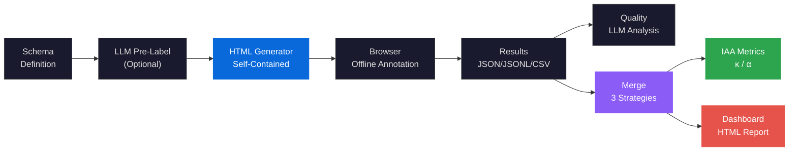
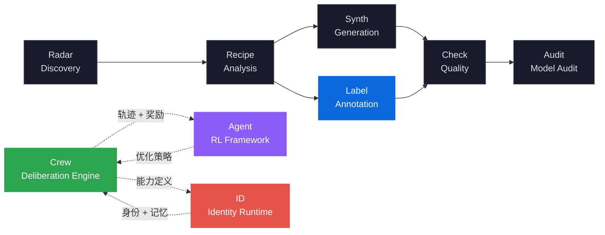

<div align="center">

<h1>DataLabel</h1>

<h3>Serverless Human-in-the-Loop Annotation Framework<br/>with LLM Pre-Labeling and Inter-Annotator Agreement Analysis</h3>

<p><strong>零服务器人机协同标注框架 — LLM 预标注 · 多标注者一致性分析 · 离线 HTML 界面</strong><br/>
<em>Zero-dependency annotation tool with LLM-assisted pre-labeling, multi-annotator agreement metrics, and offline HTML interface</em></p>

[](https://pypi.org/project/knowlyr-datalabel/)
[](https://pypi.org/project/knowlyr-datalabel/)
[](https://www.python.org/downloads/)
[](LICENSE)
<br/>
[](https://github.com/liuxiaotong/data-label/actions/workflows/ci.yml)
[](https://codecov.io/gh/liuxiaotong/data-label)
[](#development)
[](#mcp-server)
[](#annotation-types)
[](#llm-assisted-annotation)

[Abstract](#abstract) · [Problem Statement](#problem-statement) · [Formal Framework](#formal-framework) · [Architecture](#architecture) · [Key Innovations](#key-innovations) · [Quick Start](#quick-start) · [Annotation Types](#annotation-types) · [LLM Assisted Annotation](#llm-assisted-annotation) · [MCP Server](#mcp-server) · [Ecosystem](#ecosystem) · [References](#references)

</div>

---

## Abstract

高质量标注数据是监督学习和 RLHF 的基础，但现有标注工具面临两个矛盾：重量级平台（Label Studio / Prodigy）部署运维成本高，轻量工具则缺少质量保证机制。DataLabel 提出**零服务器标注范式** (serverless annotation paradigm)——生成独立 HTML 文件，浏览器直接打开即可标注，无需服务器、无需网络。

系统实现「**Schema 定义 → LLM 预标注 → 人工校准 → 质量分析 → 一致性评估 → 冲突裁决**」的完整标注管线。通过 **LLM 预标注** (pre-labeling) 加速标注启动，通过**标注者间一致性分析** (Inter-Annotator Agreement, IAA) 量化标注质量，通过**多策略合并与冲突裁决** (adjudication) 产出高质量最终标签。

> **DataLabel** implements a serverless annotation framework that generates self-contained HTML files for offline labeling. The system provides LLM-assisted pre-labeling (Kimi / OpenAI / Anthropic), 5 annotation types (scoring, single/multi-choice, text, ranking), multi-annotator result merging with 3 strategies, and rigorous IAA metrics (Cohen's $\kappa$, Fleiss' $\kappa$, Krippendorff's $\alpha$). Exposes 12 MCP tools, 6 resources, and 3 prompt templates for AI IDE integration.

---

## Problem Statement

数据标注领域面临三个结构性问题：

| 根本性问题 | 形式化定义 | 现有工具局限 | DataLabel 的方法 |
|:---|:---|:---|:---|
| **部署壁垒**<br/>Deployment Barrier | 标注平台需要服务器、数据库、网络环境，部署成本 $\gg$ 标注本身 | Label Studio 需 Docker + PostgreSQL；Prodigy 需 Python 运行时 | 零服务器：生成独立 HTML，浏览器直接打开，离线可用 |
| **冷启动延迟**<br/>Cold Start Latency | 标注员从零开始标注，前期效率低，标注指南编写耗时 | 无预标注能力，标注指南靠人工编写 | LLM 预标注 + 自动指南生成，人工从"校准"而非"从零标注"开始 |
| **质量黑箱**<br/>Quality Opacity | 标注质量缺少量化指标，分歧处理凭经验 $\implies$ 一致性 $\kappa$ 未知 | 基础工具不提供 IAA，或仅支持两人比较 | 多指标一致性分析（Cohen's / Fleiss' $\kappa$ / Krippendorff's $\alpha$）+ LLM 分歧分析 + 可视化仪表盘 |

> DataLabel 不是另一个标注平台。它是**标注数据的生产工具**——从 Schema 定义到最终标签的完整管线，零运维成本，质量可量化。

---

## Formal Framework

### Annotation Model

标注任务形式化为四元组 $\mathcal{L} = \langle X, Y, A, \phi \rangle$：

| 符号 | 定义 | 说明 |
|:---|:---|:---|
| $X = \{x_1, \ldots, x_n\}$ | 待标注样本集 | 由 Schema 定义字段结构 |
| $Y$ | 标签空间 | $Y \in \{\mathbb{R}, C, 2^C, \Sigma^*, S_k\}$，对应 5 种标注类型 |
| $A = \{a_1, \ldots, a_m\}$ | 标注者集合 | 人工标注者 + LLM 预标注者 |
| $\phi: X \times A \to Y$ | 标注函数 | $\phi(x, a)$ 为标注者 $a$ 对样本 $x$ 的标签 |

五种标签空间对应五种标注类型：评分 ($\mathbb{R}$)、单选 ($C$)、多选 ($2^C$)、文本 ($\Sigma^*$)、排序 ($S_k$，$k$ 元素的全排列)。

### Inter-Annotator Agreement (IAA)

**Cohen's Kappa**（两标注者）：

$$\kappa = \frac{p_o - p_e}{1 - p_e}$$

其中 $p_o$ 为观测一致率，$p_e$ 为随机一致率。$\kappa > 0.8$ 表示高度一致，$\kappa < 0.4$ 表示标注指南需修订。

**Fleiss' Kappa**（多标注者名义变量）：

$$\kappa_F = \frac{\bar{P} - \bar{P}_e}{1 - \bar{P}_e}, \quad \bar{P} = \frac{1}{N} \sum_i P_i, \quad P_i = \frac{1}{n(n-1)} \sum_k n_{ik}(n_{ik} - 1)$$

**Krippendorff's Alpha**（支持缺失数据、多类型量表）：

$$\alpha = 1 - \frac{D_o}{D_e}$$

其中 $D_o$ 为观测不一致度，$D_e$ 为期望不一致度。

### Merging Strategies

多标注者结果合并支持三种策略：

| 策略 | 评分 | 单选 | 多选 | 排序 |
|:---|:---|:---|:---|:---|
| **Majority** | 众数 | 众数 | 交集/并集 | Borda 计数 |
| **Average** | 算术平均 | 众数 | 交集/并集 | Borda 计数 |
| **Strict** | 全一致 | 全一致 | 全一致 | 全一致 |

Strict 模式下未达一致的任务自动标记为 `needs_review`，进入冲突裁决流程。

---

## Architecture



### Annotation Pipeline

| 步骤 | 命令 | 产出 |
|:---|:---|:---|
| 1. 生成指南 | `knowlyr-datalabel gen-guidelines schema.json` | `guide.md` (可选) |
| 2. LLM 预标注 | `knowlyr-datalabel prelabel schema.json tasks.json` | `pre.json` (可选) |
| 3. 生成界面 | `knowlyr-datalabel create schema.json tasks.json` | `annotator.html` |
| 4. 分发标注 | 发送 HTML 给标注员 | 浏览器中完成标注 |
| 5. 收集结果 | 标注员导出 JSON/JSONL/CSV | `results_*.json` |
| 6. 质量分析 | `knowlyr-datalabel quality schema.json results_*.json` | `report.json` (可选) |
| 7. 合并分析 | `knowlyr-datalabel merge results_*.json` | `merged.json` + IAA |
| 8. 进度仪表盘 | `knowlyr-datalabel dashboard results_*.json` | `dashboard.html` |

---

## Key Innovations

### 1. Serverless Annotation Architecture

生成的 HTML 包含所有样式、逻辑和数据——无需服务器、无需网络、无需安装。标注数据保存在 `localStorage`，支持断点续标。

- **零依赖部署**：发送 HTML 文件即完成分发
- **离线可用**：飞机模式、内网环境均可使用
- **暗黑模式**：一键切换，跟随系统偏好
- **快捷键**：`←` `→` 导航、数字键评分/选择、`Ctrl+Z` 撤销
- **大数据集**：任务侧边栏 + 分页 (25/50/100/200) + 搜索过滤，支持 1000+ 任务

### 2. LLM-Assisted Pre-Labeling and Quality Analysis

LLM 介入标注管线的三个环节，从"人工从零标注"转变为"人工校准 LLM 预标"：

| 环节 | 功能 | 效果 |
|:---|:---|:---|
| **预标注** | LLM 批量生成初始标签 | 标注员从"校准"开始，效率提升 |
| **质量分析** | 检测可疑标注、分析分歧原因 | 量化质量问题，指导修订 |
| **指南生成** | 根据 Schema 和样例生成标注指南 | 消除指南编写的冷启动 |

支持三个 LLM Provider：

| Provider | 环境变量 | 默认模型 |
|:---|:---|:---|
| Moonshot (Kimi) | `MOONSHOT_API_KEY` | moonshot-v1-8k |
| OpenAI | `OPENAI_API_KEY` | gpt-4o-mini |
| Anthropic | `ANTHROPIC_API_KEY` | claude-sonnet-4-20250514 |

### 3. Multi-Metric Inter-Annotator Agreement

三种 IAA 指标覆盖不同场景：

| 指标 | 适用场景 | 范围 |
|:---|:---|:---|
| Cohen's $\kappa$ | 两标注者 | $[-1, 1]$ |
| Fleiss' $\kappa$ | 多标注者、名义变量 | $[-1, 1]$ |
| Krippendorff's $\alpha$ | 多标注者、支持缺失数据 | $[-1, 1]$ |

输出两两一致矩阵 + 总体一致性 + 分歧任务列表。一致率 <40% 时建议回顾标注指南。

```bash
knowlyr-datalabel iaa ann1.json ann2.json ann3.json
```

### 4. Multi-Strategy Result Merging

三种合并策略适配不同质量要求：`majority`（通用）、`average`（连续评分）、`strict`（高质量要求，未一致标记 `needs_review`）。

支持 Borda 计数法合并排序标注，交集/并集策略合并多选标注。

### 5. Visual Analytics Dashboard

从标注结果生成独立 HTML 仪表盘（同样零依赖、离线可用）：

| 区块 | 内容 |
|:---|:---|
| 概览卡片 | 总任务数、标注员数、平均完成率、一致率 |
| 标注员进度 | 每位标注员的完成进度条 |
| 标注值分布 | SVG 柱状图展示标注值分布 |
| 一致性热力图 | Cohen's $\kappa$ 两两矩阵 + Fleiss' $\kappa$ + Krippendorff's $\alpha$ |
| 标注分歧表 | 存在分歧的任务列表（支持搜索过滤） |
| 时间分析 | 按天统计标注量趋势图 |

### 6. Five Annotation Types

通过 Schema 中的 `annotation_config` 配置，覆盖主流标注场景：

| 类型 | 标签空间 | 适用场景 |
|:---|:---|:---|
| Scoring | $\mathbb{R}$ | 质量评分、相关性打分 |
| Single Choice | $C$ | 情感分类、意图识别 |
| Multi Choice | $2^C$ | 多标签分类、属性标注 |
| Text | $\Sigma^*$ | 翻译、纠错、改写 |
| Ranking | $S_k$ | 偏好排序、RLHF 比较 |

### 7. DataRecipe Integration

直接从 DataRecipe 分析结果生成标注界面——自动推断 Schema、提取样例、生成任务：

```bash
knowlyr-datalabel generate ./analysis_output/my_dataset/
```

### 8. Conflict Adjudication

冲突裁决工具提供三种策略：多数投票、专家优先、最长回答，通过 MCP `adjudicate` 工具或 CLI 调用。

---

## Quick Start

```bash
pip install knowlyr-datalabel
```

<details>
<summary>可选依赖</summary>

```bash
pip install knowlyr-datalabel[mcp]      # MCP 服务器
pip install knowlyr-datalabel[llm]      # LLM 分析 (Kimi/OpenAI)
pip install knowlyr-datalabel[llm-all]  # LLM 分析 (含 Anthropic)
pip install knowlyr-datalabel[all]      # 全部功能
```

</details>

```bash
# 1. 创建标注界面
knowlyr-datalabel create schema.json tasks.json -o annotator.html

# 2. LLM 预标注（可选）
knowlyr-datalabel prelabel schema.json tasks.json -o pre.json -p moonshot

# 3. 浏览器打开 annotator.html，完成标注，导出结果

# 4. 合并多标注员结果 + IAA 分析
knowlyr-datalabel merge ann1.json ann2.json ann3.json -o merged.json

# 5. 生成进度仪表盘
knowlyr-datalabel dashboard ann1.json ann2.json -o dashboard.html
```

<details>
<summary>Schema 格式示例</summary>

```json
{
  "project_name": "我的标注项目",
  "fields": [
    {"name": "instruction", "display_name": "指令", "type": "text"},
    {"name": "response", "display_name": "回复", "type": "text"}
  ],
  "scoring_rubric": [
    {"score": 1, "label": "优秀", "description": "回答完整准确"},
    {"score": 0.5, "label": "一般", "description": "回答基本正确"},
    {"score": 0, "label": "差", "description": "回答错误或离题"}
  ]
}
```

</details>

<details>
<summary>Python SDK</summary>

```python
from datalabel import AnnotatorGenerator, ResultMerger

# 生成标注界面
gen = AnnotatorGenerator()
gen.generate(schema=schema, tasks=tasks, output_path="annotator.html")

# 合并标注结果
merger = ResultMerger()
result = merger.merge(["ann1.json", "ann2.json"], output_path="merged.json", strategy="majority")
print(f"一致率: {result.agreement_rate:.1%}")

# 计算 IAA
metrics = merger.calculate_iaa(["ann1.json", "ann2.json", "ann3.json"])
print(f"Fleiss' κ: {metrics['fleiss_kappa']:.3f}")
print(f"Krippendorff's α: {metrics['krippendorff_alpha']:.3f}")
```

</details>

---

## Annotation Types

<details>
<summary>5 种标注类型配置详情</summary>

### 1. Scoring (默认)

```json
{
  "scoring_rubric": [
    {"score": 1, "description": "优秀"},
    {"score": 0.5, "description": "一般"},
    {"score": 0, "description": "差"}
  ]
}
```

### 2. Single Choice

```json
{
  "annotation_config": {
    "type": "single_choice",
    "options": [
      {"value": "positive", "label": "正面"},
      {"value": "negative", "label": "负面"},
      {"value": "neutral", "label": "中性"}
    ]
  }
}
```

### 3. Multi Choice

```json
{
  "annotation_config": {
    "type": "multi_choice",
    "options": [
      {"value": "informative", "label": "信息丰富"},
      {"value": "accurate", "label": "准确"},
      {"value": "fluent", "label": "流畅"}
    ]
  }
}
```

### 4. Text

```json
{
  "annotation_config": {
    "type": "text",
    "placeholder": "请输入翻译...",
    "max_length": 500
  }
}
```

### 5. Ranking

```json
{
  "annotation_config": {
    "type": "ranking",
    "options": [
      {"value": "a", "label": "结果A"},
      {"value": "b", "label": "结果B"},
      {"value": "c", "label": "结果C"}
    ]
  }
}
```

</details>

---

## LLM Assisted Annotation

### Pre-Labeling

```bash
# Kimi 预标注
knowlyr-datalabel prelabel schema.json tasks.json -o pre.json -p moonshot

# OpenAI 预标注
knowlyr-datalabel prelabel schema.json tasks.json -o pre.json -p openai

# 指定模型和批大小
knowlyr-datalabel prelabel schema.json tasks.json -o pre.json -p moonshot -m kimi-k2 --batch-size 10
```

### Quality Analysis

```bash
# 单标注员质量检查
knowlyr-datalabel quality schema.json results.json -o report.json -p moonshot

# 多标注员分歧分析
knowlyr-datalabel quality schema.json ann1.json ann2.json -o report.json
```

### Guidelines Generation

```bash
knowlyr-datalabel gen-guidelines schema.json -t tasks.json -o guidelines.md -l zh
```

---

## MCP Server

```json
{
  "mcpServers": {
    "knowlyr-datalabel": {
      "command": "uv",
      "args": ["--directory", "/path/to/data-label", "run", "python", "-m", "datalabel.mcp_server"]
    }
  }
}
```

### Tools (12)

| Tool | Description |
|:---|:---|
| `generate_annotator` | 从 DataRecipe 分析结果生成标注界面 |
| `create_annotator` | 从 Schema 和任务创建标注界面 |
| `merge_annotations` | 合并多个标注结果 |
| `calculate_iaa` | 计算标注员间一致性 |
| `validate_schema` | 验证 Schema 和任务数据格式 |
| `export_results` | 导出为 JSON/JSONL/CSV |
| `import_tasks` | 导入任务数据 |
| `generate_dashboard` | 生成进度仪表盘 HTML |
| `llm_prelabel` | LLM 自动预标注 |
| `llm_quality_analysis` | LLM 标注质量分析 |
| `llm_gen_guidelines` | LLM 标注指南生成 |
| `adjudicate` | 冲突裁决 |

### Resources (6) · Prompts (3)

| Resources | Prompts |
|:---|:---|
| `datalabel://schemas/{type}` — 5 种 Schema 模板 | `create-annotation-schema` — 引导生成 Schema |
| `datalabel://reference/annotation-types` — 标注类型说明 | `review-annotations` — 分析标注质量 |
| | `annotation-workflow` — 完整工作流引导 |

---

## CLI Reference

<details>
<summary>完整命令列表</summary>

| 命令 | 功能 |
|:---|:---|
| `knowlyr-datalabel create <schema> <tasks> -o <out>` | 创建标注界面 |
| `knowlyr-datalabel create ... --page-size 100` | 自定义分页 |
| `knowlyr-datalabel create ... -g guidelines.md` | 附带标注指南 |
| `knowlyr-datalabel generate <dir>` | 从 DataRecipe 结果生成 |
| `knowlyr-datalabel merge <files...> -o <out>` | 合并标注结果 |
| `knowlyr-datalabel merge ... -s majority\|average\|strict` | 指定合并策略 |
| `knowlyr-datalabel iaa <files...>` | 计算标注一致性 |
| `knowlyr-datalabel dashboard <files...> -o <out>` | 生成仪表盘 |
| `knowlyr-datalabel validate <schema> [-t tasks]` | 验证格式 |
| `knowlyr-datalabel export <file> -o <out> -f json\|jsonl\|csv` | 导出转换 |
| `knowlyr-datalabel import-tasks <file> -o <out>` | 导入任务 |
| `knowlyr-datalabel prelabel <schema> <tasks> -o <out>` | LLM 预标注 |
| `knowlyr-datalabel quality <schema> <results...>` | LLM 质量分析 |
| `knowlyr-datalabel gen-guidelines <schema> -o <out>` | LLM 指南生成 |

</details>

---

## Docker

```bash
docker build -t knowlyr-datalabel .

# 创建标注界面
docker run --rm -v $(pwd):/data knowlyr-datalabel \
  create schema.json tasks.json -o annotator.html

# 合并标注结果
docker run --rm -v $(pwd):/data knowlyr-datalabel \
  merge ann1.json ann2.json -o merged.json
```

---

## Ecosystem

<details>
<summary>Architecture Diagram</summary>



</details>

| Layer | Project | Description | Repo |
|:---|:---|:---|:---|
| Discovery | **AI Dataset Radar** | 数据集竞争情报、趋势分析 | [GitHub](https://github.com/liuxiaotong/ai-dataset-radar) |
| Analysis | **DataRecipe** | 逆向分析、Schema 提取、成本估算 | [GitHub](https://github.com/liuxiaotong/data-recipe) |
| Production | **DataSynth** | LLM 批量合成 | [GitHub](https://github.com/liuxiaotong/data-synth) |
| Production | **DataLabel** | 零服务器标注 · LLM 预标注 · IAA 分析 | You are here |
| Quality | **DataCheck** | 规则验证、重复检测、分布分析 | [GitHub](https://github.com/liuxiaotong/data-check) |
| Audit | **ModelAudit** | 蒸馏检测、模型指纹 | [GitHub](https://github.com/liuxiaotong/model-audit) |
| Identity | **knowlyr-id** | 身份系统 + AI 员工运行时 | [GitHub](https://github.com/liuxiaotong/knowlyr-id) |
| Deliberation | **Crew** | 对抗式多智能体协商 · 持久记忆进化 · MCP 原生 | [GitHub](https://github.com/liuxiaotong/knowlyr-crew) |
| Agent Training | **knowlyr-agent** | Gymnasium 风格 RL 框架 · 过程奖励模型 · SFT/DPO/GRPO | [GitHub](https://github.com/liuxiaotong/knowlyr-agent) |

---

## Development

```bash
git clone https://github.com/liuxiaotong/data-label.git
cd data-label
pip install -e ".[all,dev]"
pytest    # 296 test cases
```

**CI**: GitHub Actions，Python 3.10+，Codecov 覆盖率。Tag push 自动发布 PyPI + GitHub Release。

---

## References

- **Inter-Annotator Agreement** — Artstein, R. & Poesio, M., 2008. *Inter-Coder Agreement for Computational Linguistics.* Computational Linguistics — IAA 指标的系统性综述
- **Cohen's Kappa** — Cohen, J., 1960. *A Coefficient of Agreement for Nominal Scales.* Educational and Psychological Measurement — 两标注者一致性度量
- **Fleiss' Kappa** — Fleiss, J.L., 1971. *Measuring Nominal Scale Agreement Among Many Raters.* Psychological Bulletin — 多标注者一致性推广
- **Krippendorff's Alpha** — Krippendorff, K., 2011. *Computing Krippendorff's Alpha-Reliability.* — 支持缺失数据的通用一致性度量
- **Active Learning** — Settles, B., 2009. *Active Learning Literature Survey.* CS Technical Report, University of Wisconsin-Madison — 主动学习选择策略
- **RLHF** — Christiano, P. et al., 2017. *Deep RL from Human Preferences.* [arXiv:1706.03741](https://arxiv.org/abs/1706.03741) — 人类偏好标注驱动的强化学习

---

## License

[MIT](LICENSE)

---

<div align="center">
<sub><a href="https://github.com/liuxiaotong">knowlyr</a> — serverless annotation framework with LLM pre-labeling and inter-annotator agreement analysis</sub>
</div>
