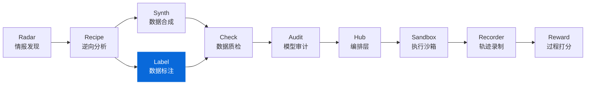

<div align="center">

# DataLabel

**轻量级数据标注工具 - 零服务器依赖的 HTML 标注界面**
**Lightweight, serverless HTML labeling tool for offline teams**

[](https://pypi.org/project/knowlyr-datalabel/)
[](https://www.python.org/downloads/)
[](LICENSE)
[](#mcp-server)
[](#docker)

[快速开始](#快速开始) · [标注类型](#标注类型) · [结果合并](#结果合并) · [IAA 指标](#计算标注一致性-iaa) · [MCP Server](#mcp-server) · [Docker](#docker) · [生态](#data-pipeline-生态)

</div>

---

生成独立的 HTML 标注界面，无需部署服务器，浏览器直接打开即可使用。支持 5 种标注类型、暗黑模式、撤销、统计面板、多格式导入导出，以及多标注员结果合并与一致性分析。

## 核心能力

```
数据 Schema + 任务列表 → 生成 HTML → 浏览器标注 → 导出结果 → 合并分析
```

### 特性一览

| 特性 | 说明 |
|------|------|
| **零依赖部署** | 生成的 HTML 包含所有样式和逻辑，无需服务器 |
| **离线可用** | 标注数据保存在 localStorage，支持断点续标 |
| **5 种标注类型** | 评分、单选、多选、文本、排序 |
| **暗黑模式** | 一键切换，跟随系统偏好，localStorage 持久化 |
| **撤销支持** | `Ctrl+Z` 撤销当前任务标注 |
| **统计面板** | 实时完成率、分数/选项分布图 |
| **快捷键** | `←` `→` 导航、数字键评分/选择、`?` 快捷键帮助 |
| **大数据集** | 任务侧边栏 + 分页 + 搜索/过滤，支持 1000+ 任务 |
| **多标注员** | 合并多个标注结果，计算 IAA (Cohen's/Fleiss' Kappa, Krippendorff's Alpha) |
| **多格式导入导出** | JSON / JSONL / CSV 三种格式 |
| **Schema 校验** | 输入验证 + 友好的中文错误提示 |
| **DataRecipe 集成** | 直接从 DataRecipe 分析结果生成标注界面 |
| **MCP 支持** | 可作为 Claude Desktop / Claude Code 的工具使用 |
| **Docker** | 容器化运行，无需安装 Python 环境 |

### 工作流

| 步骤 | 命令 | 产出 |
|------|------|------|
| 1. 生成界面 | `knowlyr-datalabel create schema.json tasks.json -o annotator.html` | `annotator.html` |
| 2. 分发标注 | 发送 HTML 给标注员 | 浏览器中完成标注 |
| 3. 收集结果 | 标注员导出 JSON/JSONL/CSV | `results_*.json` |
| 4. 合并分析 | `knowlyr-datalabel merge results_*.json -o merged.json` | `merged.json` + IAA 报告 |

## 安装

```bash
pip install knowlyr-datalabel
```

可选依赖：

```bash
pip install knowlyr-datalabel[mcp]      # MCP 服务器
pip install knowlyr-datalabel[dev]      # 开发依赖 (pytest, ruff)
pip install knowlyr-datalabel[all]      # 全部功能
```

## 快速开始

### 从自定义 Schema 创建

```bash
knowlyr-datalabel create schema.json tasks.json -o annotator.html

# 附带标注指南和自定义标题
knowlyr-datalabel create schema.json tasks.json -o annotator.html -g guidelines.md -t "我的项目"

# 自定义分页大小 (默认 50)
knowlyr-datalabel create schema.json tasks.json -o annotator.html --page-size 100
```

### 从 DataRecipe 分析结果生成

```bash
knowlyr-datalabel generate ./analysis_output/my_dataset/
```

### Schema 格式示例

```json
{
  "project_name": "我的标注项目",
  "fields": [
    {"name": "instruction", "display_name": "指令", "type": "text"},
    {"name": "response", "display_name": "回复", "type": "text"}
  ],
  "scoring_rubric": [
    {"score": 1, "label": "优秀", "description": "回答完整准确"},
    {"score": 0.5, "label": "一般", "description": "回答基本正确"},
    {"score": 0, "label": "差", "description": "回答错误或离题"}
  ]
}
```

### 验证 Schema 格式

```bash
# 仅验证 Schema
knowlyr-datalabel validate schema.json

# 同时验证 Schema 和任务数据
knowlyr-datalabel validate schema.json -t tasks.json
```

---

## 标注类型

DataLabel 支持 5 种标注类型，通过 Schema 中的 `annotation_config` 配置。不配置时默认使用 `scoring_rubric` 评分模式。

### 1. 评分 (scoring) — 默认

使用 `scoring_rubric` 定义评分标准，无需 `annotation_config`。

```json
{
  "scoring_rubric": [
    {"score": 1, "description": "优秀"},
    {"score": 0.5, "description": "一般"},
    {"score": 0, "description": "差"}
  ]
}
```

### 2. 单选 (single_choice)

```json
{
  "annotation_config": {
    "type": "single_choice",
    "options": [
      {"value": "positive", "label": "正面"},
      {"value": "negative", "label": "负面"},
      {"value": "neutral", "label": "中性"}
    ]
  }
}
```

### 3. 多选 (multi_choice)

```json
{
  "annotation_config": {
    "type": "multi_choice",
    "options": [
      {"value": "informative", "label": "信息丰富"},
      {"value": "accurate", "label": "准确"},
      {"value": "fluent", "label": "流畅"}
    ]
  }
}
```

### 4. 文本 (text)

```json
{
  "annotation_config": {
    "type": "text",
    "placeholder": "请输入翻译...",
    "max_length": 500
  }
}
```

### 5. 排序 (ranking)

支持拖拽排序。

```json
{
  "annotation_config": {
    "type": "ranking",
    "options": [
      {"value": "a", "label": "结果A"},
      {"value": "b", "label": "结果B"},
      {"value": "c", "label": "结果C"}
    ]
  }
}
```

---

## 结果合并

### 合并多个标注员结果

```bash
# 合并三个标注员的结果
knowlyr-datalabel merge ann1.json ann2.json ann3.json -o merged.json

# 使用不同的合并策略
knowlyr-datalabel merge ann1.json ann2.json ann3.json -o merged.json --strategy average
```

### 合并策略

| 策略 | 说明 | 适用场景 |
|------|------|----------|
| `majority` | 多数投票 | 通用场景 (默认) |
| `average` | 取平均值 | 连续评分 |
| `strict` | 所有人一致才确定，否则标记需审核 | 高质量要求 |

各标注类型的合并逻辑：

| 标注类型 | majority | average | strict |
|----------|----------|---------|--------|
| scoring | 众数 | 算术平均 | 全一致 |
| single_choice | 众数 | 众数 | 全一致 |
| multi_choice | 交集/并集 | 交集/并集 | 全一致 |
| text | 收集全部 | 收集全部 | 全一致 |
| ranking | Borda 计数 | Borda 计数 | 全一致 |

### 计算标注一致性 (IAA)

```bash
knowlyr-datalabel iaa ann1.json ann2.json ann3.json
```

输出示例：

```
标注员间一致性 (IAA) 指标:
  标注员数: 3
  共同任务: 100
  完全一致率: 45.0%
  Fleiss' Kappa: 0.523
  Krippendorff's Alpha: 0.518

两两一致矩阵 (Agreement / Cohen's Kappa):
              ann1.json  ann2.json  ann3.json
ann1.json       ---       72%/κ0.58  68%/κ0.52
ann2.json     72%/κ0.58     ---      75%/κ0.63
ann3.json     68%/κ0.52  75%/κ0.63     ---
```

**IAA 指标说明**：

| 指标 | 范围 | 说明 |
|------|------|------|
| 完全一致率 | 0-100% | 所有标注员完全一致的任务比例 |
| Cohen's Kappa | -1 ~ 1 | 两两标注员间一致性（校正随机一致） |
| Fleiss' Kappa | -1 ~ 1 | 多标注员名义一致性 |
| Krippendorff's Alpha | -1 ~ 1 | 多标注员一致性（支持缺失数据） |

> 完全一致率 <40% 时通常表示标注指南存在歧义，建议回顾培训或同步口径。

---

## 导入导出

### 浏览器端导出

在标注界面中选择导出格式 (JSON / JSONL / CSV)，点击导出按钮即可下载。

### CLI 格式转换

```bash
# 将标注结果转为 JSONL
knowlyr-datalabel export results.json -o results.jsonl -f jsonl

# 将标注结果转为 CSV
knowlyr-datalabel export results.json -o results.csv -f csv

# 导入 CSV 任务数据为 JSON
knowlyr-datalabel import-tasks tasks.csv -o tasks.json

# 导入 JSONL 任务数据
knowlyr-datalabel import-tasks tasks.jsonl -o tasks.json

# 指定格式（默认自动检测后缀）
knowlyr-datalabel import-tasks data.txt -o tasks.json -f jsonl
```

### 标注结果格式

```json
{
  "schema": { "..." },
  "metadata": {
    "exported_at": "2025-01-15T10:00:00",
    "total_tasks": 100,
    "completed_tasks": 95,
    "annotation_type": "scoring",
    "tool": "DataLabel"
  },
  "responses": [
    {"task_id": "TASK_001", "score": 1, "comment": "准确"},
    {"task_id": "TASK_002", "choice": "positive", "comment": ""},
    {"task_id": "TASK_003", "choices": ["accurate", "fluent"], "comment": ""},
    {"task_id": "TASK_004", "text": "翻译结果...", "comment": ""},
    {"task_id": "TASK_005", "ranking": ["a", "c", "b"], "comment": ""}
  ]
}
```

---

## Docker

### 构建镜像

```bash
docker build -t knowlyr-datalabel .
```

### 使用

```bash
# 查看帮助
docker run --rm knowlyr-datalabel

# 创建标注界面（挂载当前目录）
docker run --rm -v $(pwd):/data knowlyr-datalabel \
  create schema.json tasks.json -o annotator.html

# 合并标注结果
docker run --rm -v $(pwd):/data knowlyr-datalabel \
  merge ann1.json ann2.json -o merged.json

# 计算 IAA
docker run --rm -v $(pwd):/data knowlyr-datalabel \
  iaa ann1.json ann2.json

# 格式转换
docker run --rm -v $(pwd):/data knowlyr-datalabel \
  export results.json -o results.csv -f csv
```

---

## MCP Server

在 Claude Desktop / Claude Code 中直接使用 DataLabel 功能。

### 配置

添加到 `~/Library/Application Support/Claude/claude_desktop_config.json`：

```json
{
  "mcpServers": {
    "knowlyr-datalabel": {
      "command": "uv",
      "args": ["--directory", "/path/to/data-label", "run", "python", "-m", "datalabel.mcp_server"]
    }
  }
}
```

### 可用工具

| 工具 | 功能 |
|------|------|
| `generate_annotator` | 从 DataRecipe 分析结果生成标注界面 |
| `create_annotator` | 从 Schema 和任务创建标注界面 (支持 5 种标注类型) |
| `merge_annotations` | 合并多个标注结果 |
| `calculate_iaa` | 计算标注员间一致性 (Cohen's/Fleiss' Kappa, Krippendorff's Alpha) |

---

## 示例

`examples/` 目录包含可直接运行的示例脚本：

```bash
# 基本工作流：定义 Schema → 生成 HTML → 模拟标注 → 合并 → IAA
python examples/basic_workflow.py

# 5 种标注类型演示
python examples/multi_type_annotation.py

# DataRecipe 输出 → DataLabel 管道
python examples/pipeline_datarecipe_to_label.py
```

示例数据位于 `examples/sample_data/`：

| 文件 | 说明 |
|------|------|
| `schema.json` | 评分标注 Schema |
| `classification_schema.json` | 单选分类 Schema |
| `tasks.json` | 5 条示例任务 |
| `results_annotator1.json` | 标注员 1 结果 |
| `results_annotator2.json` | 标注员 2 结果 |

---

## 命令参考

| 命令 | 功能 |
|------|------|
| `knowlyr-datalabel create <schema> <tasks> -o <out>` | 从 Schema 创建标注界面 |
| `knowlyr-datalabel create ... --page-size 100` | 自定义分页大小 |
| `knowlyr-datalabel create ... -g guidelines.md` | 附带标注指南 |
| `knowlyr-datalabel create ... -t "标题"` | 自定义标题 |
| `knowlyr-datalabel generate <dir>` | 从 DataRecipe 结果生成 |
| `knowlyr-datalabel merge <files...> -o <out>` | 合并标注结果 |
| `knowlyr-datalabel merge ... -s majority\|average\|strict` | 指定合并策略 |
| `knowlyr-datalabel iaa <files...>` | 计算标注一致性 |
| `knowlyr-datalabel validate <schema> [-t tasks]` | 验证 Schema/任务格式 |
| `knowlyr-datalabel export <file> -o <out> -f json\|jsonl\|csv` | 导出格式转换 |
| `knowlyr-datalabel import-tasks <file> -o <out> [-f format]` | 导入任务数据 |

---

## API 使用

### 生成标注界面

```python
from datalabel import AnnotatorGenerator

generator = AnnotatorGenerator()
result = generator.generate(
    schema={"fields": [...], "scoring_rubric": [...]},
    tasks=[{"id": "1", "data": {...}}],
    output_path="annotator.html",
    guidelines="# 标注指南\n\n请按照以下标准...",
    title="我的标注项目",
    page_size=50,
)
```

### 合并标注结果

```python
from datalabel import ResultMerger

merger = ResultMerger()
result = merger.merge(
    result_files=["ann1.json", "ann2.json", "ann3.json"],
    output_path="merged.json",
    strategy="majority",
)

print(f"一致率: {result.agreement_rate:.1%}")
print(f"冲突数: {len(result.conflicts)}")
```

### 计算 IAA

```python
from datalabel import ResultMerger

merger = ResultMerger()
metrics = merger.calculate_iaa(["ann1.json", "ann2.json", "ann3.json"])

print(f"完全一致率: {metrics['exact_agreement_rate']:.1%}")
print(f"Fleiss' Kappa: {metrics['fleiss_kappa']:.3f}")
print(f"Krippendorff's Alpha: {metrics['krippendorff_alpha']:.3f}")
```

### 验证 Schema

```python
from datalabel import SchemaValidator

validator = SchemaValidator()
result = validator.validate_schema(schema)

if not result.valid:
    print("错误:", result.errors)
if result.warnings:
    print("警告:", result.warnings)
```

---

## 项目架构

```
src/datalabel/
├── __init__.py           # 包入口 (AnnotatorGenerator, ResultMerger, SchemaValidator)
├── generator.py          # HTML 标注界面生成器
├── merger.py             # 标注结果合并 & IAA (Cohen's/Fleiss' Kappa, Krippendorff's Alpha)
├── validator.py          # Schema & 任务数据校验
├── cli.py                # CLI 命令行工具 (8 命令)
├── mcp_server.py         # MCP Server (4 工具)
└── templates/
    └── annotator.html    # Jinja2 HTML 模板 (暗黑模式, 统计面板, 撤销, 快捷键)

tests/                    # 72 个测试
examples/                 # 可运行示例脚本 + 示例数据
Dockerfile                # Docker 容器化支持
```

---

## Data Pipeline 生态

DataLabel 是 Data Pipeline 生态的标注组件：



### 端到端工作流

```bash
# 1. DataRecipe: 分析数据集，生成 Schema 和样例
knowlyr-datarecipe deep-analyze tencent/CL-bench -o ./output

# 2. DataLabel: 生成标注界面，人工标注/校准种子数据
knowlyr-datalabel generate ./output/tencent_CL-bench/

# 3. DataSynth: 基于种子数据批量合成
knowlyr-datasynth generate ./output/tencent_CL-bench/ -n 1000

# 4. DataCheck: 质量检查
knowlyr-datacheck validate ./output/tencent_CL-bench/
```

### 生态项目

| 项目 | 说明 | 仓库 |
|------|------|------|
| **AI Dataset Radar** | 数据集竞争情报、趋势分析 | [GitHub](https://github.com/liuxiaotong/ai-dataset-radar) |
| **DataRecipe** | 逆向分析、Schema 提取、成本估算 | [GitHub](https://github.com/liuxiaotong/data-recipe) |
| **DataSynth** | LLM 批量合成、种子数据扩充 | [GitHub](https://github.com/liuxiaotong/data-synth) |
| **DataLabel** | 轻量标注工具、多标注员合并 | 当前项目 |
| **DataCheck** | 规则验证、重复检测、分布分析 | [GitHub](https://github.com/liuxiaotong/data-check) |
| **ModelAudit** | 蒸馏检测、模型指纹、身份验证 | [GitHub](https://github.com/liuxiaotong/model-audit) |
| **AgentSandbox** | Docker 执行沙箱、轨迹重放 | [GitHub](https://github.com/liuxiaotong/agent-sandbox) |
| **AgentRecorder** | 标准化轨迹录制、多框架适配 | [GitHub](https://github.com/liuxiaotong/agent-recorder) |
| **AgentReward** | 过程级 Reward、Rubric 多维评估 | [GitHub](https://github.com/liuxiaotong/agent-reward) |
| **TrajectoryHub** | Pipeline 编排、数据集导出 | [GitHub](https://github.com/liuxiaotong/agent-trajectory-hub) |

---

## License

[MIT](LICENSE)

---

<div align="center">
<sub>为数据标注团队提供轻量级、零部署的标注解决方案</sub>
</div>
